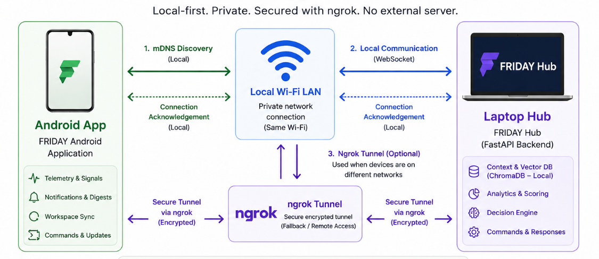
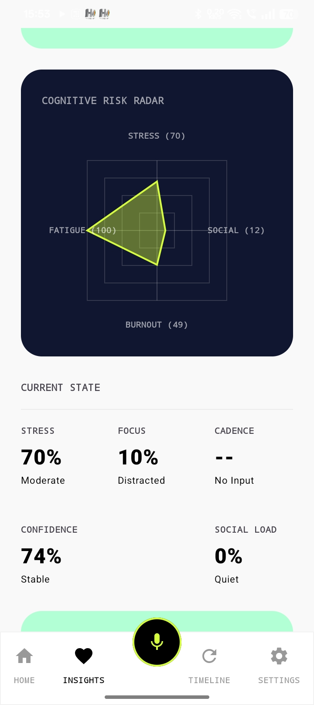
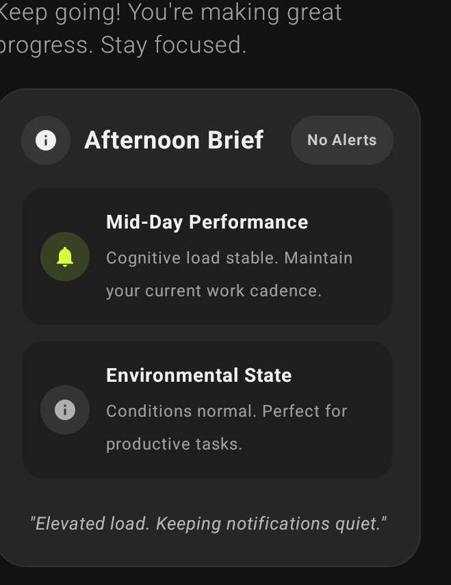
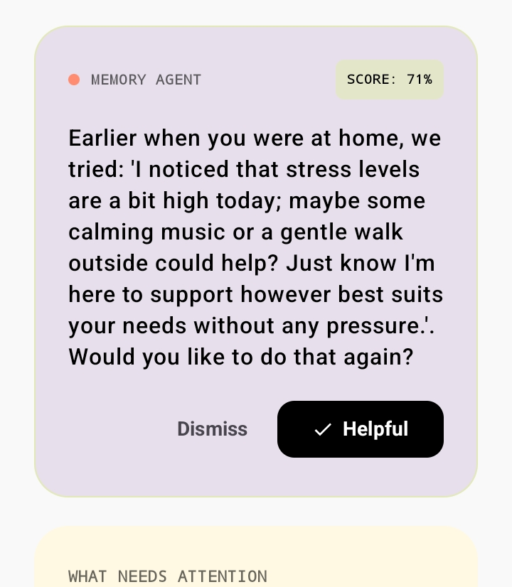
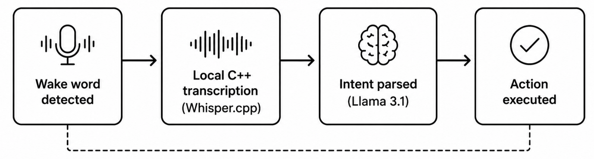

# FRIDAY: User Experience Guide

A complete guide to your ambient AI workspace partner.

## Table of Contents

1. [What FRIDAY Is](#1-what-friday-is)
2. [Getting Started](#2-getting-started)
3. [Core Features](#3-core-features)
4. [Interface and Visual States](#4-interface-and-visual-states)
5. [Network and Offline Behavior](#5-network-and-offline-behavior)
6. [Privacy: What Stays On Your Device](#6-privacy-what-stays-on-your-device)
7. [Settings and Customization](#7-settings-and-customization)
8. [Troubleshooting and FAQ](#8-troubleshooting-and-faq)

## 1. What FRIDAY Is

Most digital assistants wait to be asked something. FRIDAY does not work that way.

FRIDAY is a passive, ambient system that runs across your phone and laptop simultaneously. It watches how you work, not what you type, and uses that signal to protect your focus, triage your notifications, and rebuild your workspace when you return from a break. Everything it does runs on your own hardware. Nothing leaves your devices.

## 2. Getting Started

Because FRIDAY processes everything locally, your phone and laptop need to discover each other before anything works. This takes about 30 seconds on first setup.

### Steps

1. **Start the Laptop Hub** — open a terminal and run the FRIDAY backend. Wait for the message: `FRIDAY is listening...`
2. **Open the Android App** — FRIDAY automatically discovers the laptop over your local Wi-Fi using mDNS. No IP addresses, no manual pairing.
3. **Begin working** — once both devices show a connected status, FRIDAY is active. Put your phone down and work normally.

### First-Time Checklist

- [ ] Laptop hub is running in terminal
- [ ] Both devices are on the same Wi-Fi network
- [ ] Android app shows "Connected"
- [ ] Notification access granted on Android
- [ ] Microphone permission granted on Android

## 3. Core Features

### Focus Protection (Empathetic Silence)

You do not configure this feature. It runs passively.

FRIDAY monitors your typing pace and active window context. When it detects a sustained high-focus or high-stress state, it quietly holds non-urgent notifications on your phone rather than delivering them. Your phone stays silent. When you resurface and unlock it, the held notifications are waiting.

The decision to hold or deliver is governed by a mathematical scoring formula. If the computed score falls below a threshold of 40, FRIDAY suppresses the interruption entirely and logs the context silently. No alert, no badge, no vibration.

### Notification Digest

When you pick up your phone after a long session, FRIDAY does not show you a wall of 50 missed alerts. Instead it shows a single digest card summarizing what happened while you were focused.

Example output:

---

### Semantic Workspace Restoration

Standard device handoff moves one active tab from your phone to your laptop. FRIDAY restores an entire task cluster.

When you leave your laptop, FRIDAY saves a semantic embedding of your full workspace state: the tabs open, the documents active, the research context you were in. When you return and click the Chrome Extension, it presents a confirmation card:

> "Restore your Neural Ethics research workspace? [Yes] [No]"

If you confirm, FRIDAY reopens the full cluster together: related research tabs, the active PDF, the draft document. If you decline, nothing changes.

Nothing is restored without your explicit confirmation.

### Ghost Mode

Ghost Mode activates in two situations:

**Burnout Detection.** FRIDAY tracks your typing rhythm continuously. If your typing becomes erratic, slow, and error-heavy compared to your personal baseline, FRIDAY interprets this as high cognitive fatigue. The Chrome Extension switches to a dark Block Navy theme, hides non-essential tabs, and surfaces a gentle prompt to take a break.

**Unrecognized User.** Because FRIDAY builds a behavioral fingerprint from your personal typing patterns, a different person typing on your laptop produces a mismatch. Ghost Mode triggers automatically, obscuring your workspace until your own rhythm is detected again.

### Voice Commands

Say the wake word **"FRIDAY"** near your phone, followed by a natural language request:

> "FRIDAY, remind me to email Thomas about the purchase order."

Voice is transcribed locally using a C++ audio engine (Whisper.cpp). The audio never leaves your device. Response time is under one second on standard hardware.

## 4. Interface and Visual States

The FRIDAY Chrome Extension uses color to communicate its current state without requiring you to read anything.

**Block Lilac (Aware Mode)**
FRIDAY is active and monitoring. Your environment is normal. Context is being logged in the background.

**Block Navy (Ghost Mode)**
High stress or unrecognized typing rhythm detected. The interface darkens, non-essential tabs are hidden, and your workspace memory is shielded.

**Block Lime (Interaction Mode)**
FRIDAY has a card that needs your response. This is when workspace restore prompts or break suggestions appear.

## 5. Network and Offline Behavior

FRIDAY operates across three network conditions without any manual intervention.

**On local Wi-Fi (primary)**
mDNS automatically binds the Android app to the laptop hub. All processing runs over the local network. No configuration needed.

**On mobile data or a different network (secondary)**
FRIDAY bridges the connection through a private encrypted mesh (Tailscale or ZeroTier). No data passes through a public relay. The connection is peer-to-peer between your phone and laptop.

**Fully offline (fallback)**
If the laptop is unreachable entirely, the Android app routes to an on-device AI model (Phi-3 Mini, INT4 quantized). FRIDAY continues generating digests and logging context. Everything recorded during the offline period syncs back to the laptop hub in write-order when the connection returns.

## 6. Privacy: What Stays On Your Device

Every piece of analysis FRIDAY performs happens on your own hardware.

**Always processed locally:**
- Typing rhythm and focus state scoring
- Notification triage and digest generation
- Voice transcription and intent parsing
- Workspace context embedding and retrieval

**Never sent anywhere external:**
- Raw audio from voice commands
- Notification content or message text
- Typing biometrics or behavioral patterns
- Browser history or tab content

FRIDAY has no internet permission on Android. It is architecturally incapable of transmitting data to a cloud server because the permission does not exist in the manifest.

## 7. Settings and Customization

FRIDAY is designed to work well without any configuration. These settings exist for users who want to tune the behavior to their specific patterns.

**Focus Sensitivity**
Controls how aggressively typing pace and context signals trigger notification hold. Lower sensitivity means FRIDAY waits for stronger evidence of focus before silencing alerts.

**Digest Frequency**
Choose whether a digest appears after every break or only after sessions longer than a defined duration.

**Ghost Mode Sensitivity**
Adjusts how much typing rhythm deviation triggers Ghost Mode. Useful on shared devices or for users whose rhythm varies significantly across the day.

**Wake Word Sensitivity**
Controls how easily "FRIDAY" is picked up in noisy environments. Higher sensitivity helps in quiet rooms. Lower sensitivity reduces false triggers in shared spaces.

---

## 8. Troubleshooting and FAQ

**The Android app shows "Not Connected".**

Confirm the laptop hub terminal is still running and shows "FRIDAY is listening...". Confirm both devices are on the same Wi-Fi network. Restart the Android app to re-trigger mDNS discovery.

**Empathetic Silence is not holding notifications.**

Check that notification access permission is granted to FRIDAY in your Android settings. Note that brief typing bursts may not cross the focus threshold. FRIDAY needs a sustained session before it acts.

**Ghost Mode triggers too frequently.**

Your typing rhythm changes naturally with fatigue, posture, and time of day. Lower the Ghost Mode sensitivity in Settings, or allow a few more sessions for FRIDAY to recalibrate your personal baseline.

**Workspace restore is not bringing back the right tabs.**

The Chrome Extension must have been active during your original session. FRIDAY can only restore context it observed being built. If the extension was off when you opened those tabs, they were not logged.

**Voice commands are not responding.**

Confirm microphone permission is granted in Android settings. Test in a quieter environment first. Wake word sensitivity is adjustable in Settings.

**The digest summary looks wrong or incomplete.**

If FRIDAY was offline during part of your session, some notifications may have been buffered and synced late. Wait for the sync to complete after reconnecting, then check the digest again.